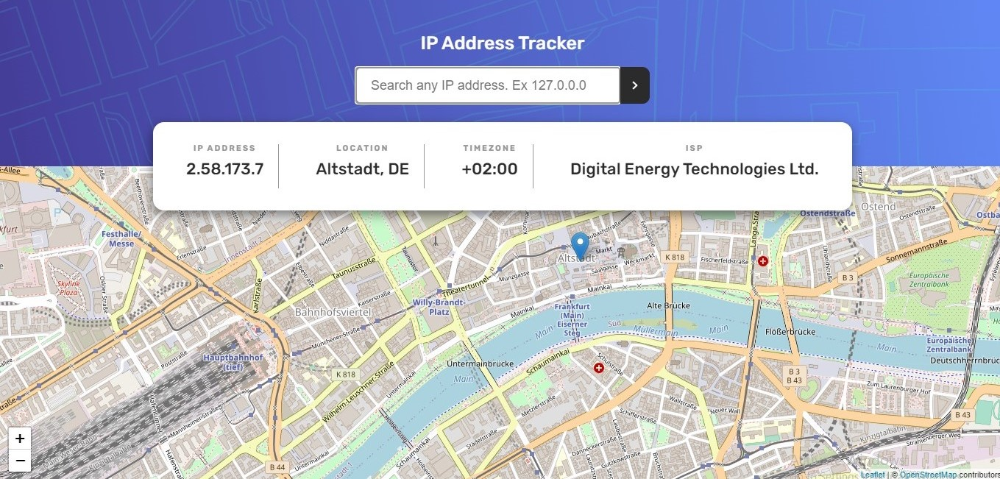

# IP Address Tracker

## 🔖 Description

🌐 IP address tracking application through geolocation. I get this design from Frontend Mentors, an excellent platform for getting ideas to make your projects.

You can search any IP that you have and get the location, time zone, ISP, and overview on the map on this website.

---

## 🚀 Technologies

This project is using the following technologies:

- HTML
- CSS
- [Emotion](https://emotion.sh/docs/introduction)
- [Next.js](https://nextjs.org/)
- [React](https://reactjs.org/)
- [Geo IPify](https://geo.ipify.org/)
- [Leaflet](https://leafletjs.com/)

---

## 🎲 How to use

```bash
$ npm install
$ npm run dev
```

Note: For personal/professional use, please create your account and use your own token.

---

## 🎨 Layout



---

<p>Create with ❤️ by <a href='https://github.com/flaviaferri' target='_blank'>Flavia Ferri</a></p>
